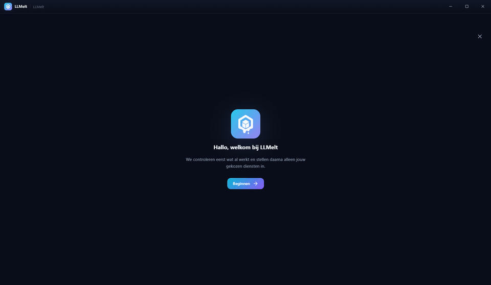
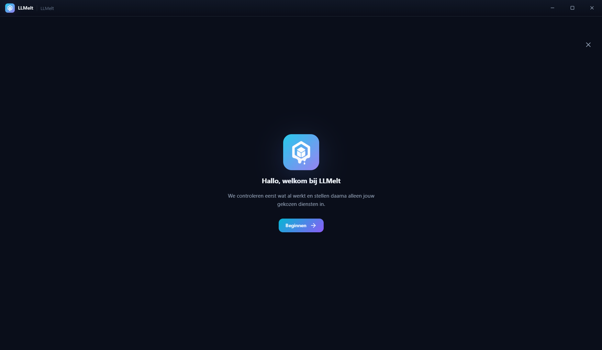
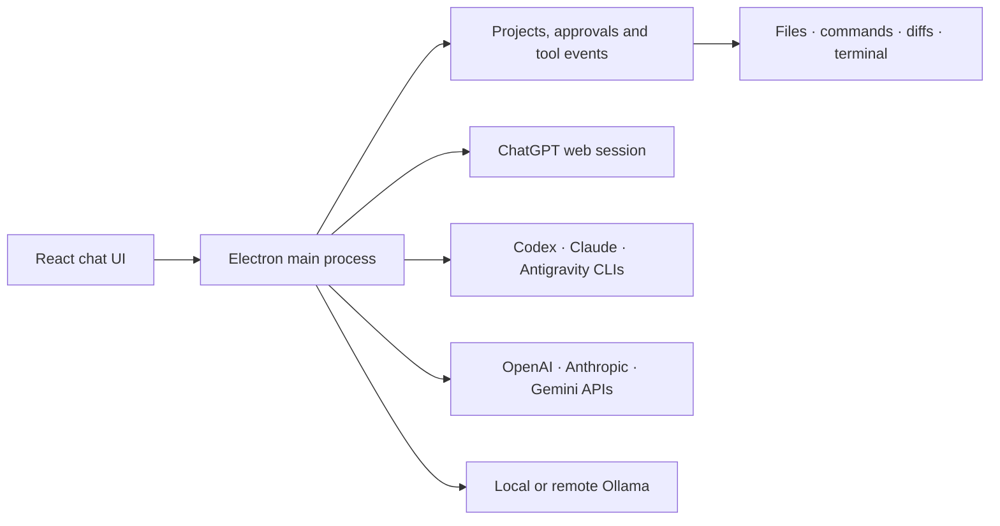

<p align="center">
  
</p>

<h1 align="center">LLMelt</h1>

<p align="center">
  <strong>Your AI accounts, coding agents and local models in one Windows workspace.</strong>
  <br>
  Chat with them, let them use real tools with your approval, and switch providers without switching apps.
</p>

<p align="center">
  <a href="https://github.com/JustMLC4real/LLMelt/releases/latest"></a>
  
  
  
  <a href="./LICENSE"></a>
</p>

<p align="center">
  <a href="https://github.com/JustMLC4real/LLMelt/releases/latest"><strong>Download for Windows</strong></a>
  ·
  <a href="./docs/README.md">Documentation</a>
  ·
  <a href="#safety-by-design">Safety</a>
  ·
  <a href="#development">Development</a>
</p>

---

LLMelt is a Windows desktop app for working with several AI providers through one consistent chat and agent interface. It can use a signed-in ChatGPT session, native coding CLIs, paid APIs and fully local Ollama models. Each conversation remembers its provider, model, project, permissions and tool history.

<p align="center">
  
</p>

## Everything stays in one workflow

Start a conversation, pick the exact provider and model you want, and keep the prompt, tool activity and answer together.

| | What LLMelt adds |
|---|---|
| **One model picker** | Live provider catalogs instead of a hard-coded model list. Choose model, effort and speed where the provider exposes them. |
| **Real agent tools** | Read, create and edit project files, run commands, inspect diffs and keep tool activity beside the answer. |
| **Approval controls** | Ask for every action, automatically allow workspace-safe file work, or explicitly grant full access per chat. |
| **Automatic fallback** | Continue with the next configured model when a provider is exhausted or temporarily unavailable. Paid API fallback is opt-in. |
| **Usage dashboard** | Track context usage, token totals and provider quota windows when the provider exposes reliable machine-readable data. |
| **Projects and terminals** | Keep chats grouped by project and use resizable PowerShell terminals without leaving the app. |
| **Local-first option** | Ollama runs on your own machine and has no external provider quota. |

## A guided first start

The onboarding flow checks what is already installed, lets you choose what you actually want to use and opens official installers or login flows only after you ask it to.

<p align="center">
  
</p>

<details>
  <summary>View the full-resolution screenshots</summary>
  <br>
  <p align="center">
    
  </p>
  <p align="center">
    
    
  </p>
</details>

<sub>Screenshots are generated from a clean, isolated app profile with <code>npm run capture:readme</code>; no personal chats, credentials or settings are included.</sub>

## Supported providers

LLMelt does not pretend that every provider works the same way. It uses the closest supported integration for each one and keeps file, command and approval policy in the app.

| Provider | Connection | Agent tools | Usage / limits |
|---|---|---|---|
| **ChatGPT** | Signed-in ChatGPT web session; no API key required | LLMelt tool loop | Runtime limit detection; ChatGPT does not expose a supported subscription counter |
| **OpenAI API** | API key | LLMelt tool loop | API usage returned by the provider where available |
| **Codex** | Native Codex CLI login | Native Codex tools and app approvals | Live Codex account rate-limit windows |
| **Claude** | Claude Code CLI or Anthropic API | Native Claude tools and app approvals | CLI statusline windows when Claude exposes them |
| **Gemini** | Gemini Developer API key + Google Cloud project | Native function calling and app approvals | Cloud quota and monitoring data |
| **Antigravity** | Antigravity CLI | Native CLI hooks and app approvals | Statusline data where exposed; runtime limit detection otherwise |
| **Ollama** | Local Ollama server | Native function calling for compatible models | Local model; no provider subscription quota |
| **Remote** | SSH to your own Ollama host | Remote model execution | Depends on your remote host |

Provider accounts, subscriptions and API charges are not included with LLMelt.

## Safety by design

Giving an AI access to a real project is powerful, so the permission boundary is visible and configurable:

- **Ask mode** requests approval for each file or command action. Clicking outside an approval postpones it instead of silently denying it.
- **Workspace mode** automatically allows validated file operations inside the selected project while commands still require approval.
- **Full access** is explicit, per chat and clearly marked as risky.
- Renderer code runs with Electron sandboxing and context isolation; external links open outside the privileged app window.
- API keys and remote credentials are protected with Electron `safeStorage` / Windows DPAPI.
- File paths and shell requests pass through the central validation and approval layer, including native provider tools.

Read the implementation details in [Agent tools and approvals](./docs/06-agent-tools.md) and [Provider integrations](./docs/04-providers.md).

## Install

1. Download the newest `LLMelt-Setup-*.exe` from [GitHub Releases](https://github.com/JustMLC4real/LLMelt/releases/latest).
2. Run the installer and start LLMelt.
3. Let the onboarding guide detect your existing accounts, CLIs and local models.
4. Select only the providers you want to connect.

> [!IMPORTANT]
> Current Windows builds are not code-signed. Windows SmartScreen may therefore show an "Unknown publisher" warning. Verify that the installer comes from this repository's Releases page before running it.

Updates are downloaded from this repository's GitHub Releases and installed only after you choose to install the ready update.

## How it fits together



- **Desktop:** Electron 43
- **UI:** React 19, TypeScript, Vite and Zustand
- **Data:** Node's built-in SQLite with WAL
- **Providers:** provider-specific adapters behind one shared streaming contract
- **Release:** electron-builder and GitHub Releases

The full code-oriented tour starts at [AGENTS.md](./AGENTS.md). The documentation index is in [docs/README.md](./docs/README.md).

## Development

Requirements: Windows, Node.js 24 and npm.

```powershell
git clone https://github.com/JustMLC4real/LLMelt.git
cd LLMelt
npm ci
npm run dev
```

Useful checks:

```powershell
npm run lint             # ESLint
npm test                 # logic, fresh-start and security tests
npm run build            # TypeScript + Vite build
npm run package          # Windows NSIS installer
npm run capture:readme   # refresh the safe README screenshots
npm run capture:readme:chat # record the live Antigravity chat demo (uses account quota)
```

The live provider tests are opt-in because they may use local accounts or paid API quota. See [Build and release](./docs/08-build-release.md) before publishing a version.

## Current scope

- Windows is the supported desktop platform today.
- Provider features depend on the provider's current CLI, account and API capabilities.
- LLMelt is an independent project and is not affiliated with OpenAI, Anthropic, Google or Ollama.

## License

[MIT](./LICENSE) © Justin Laponder
