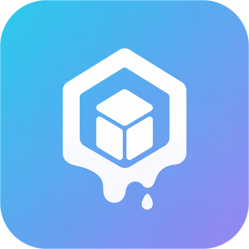
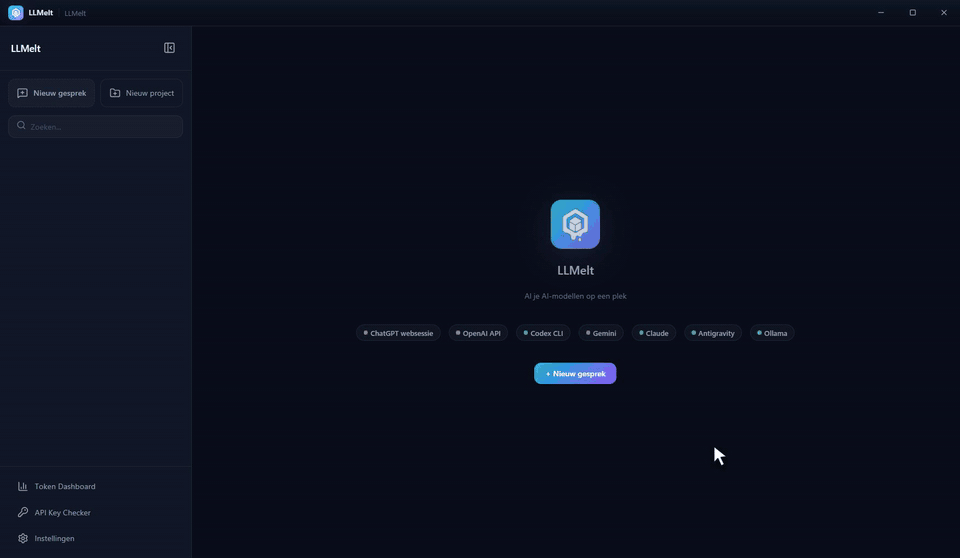
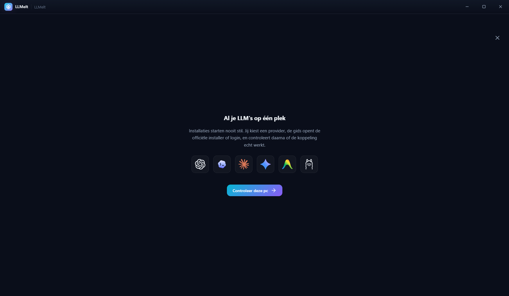
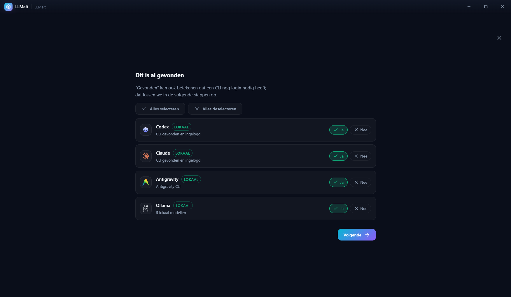
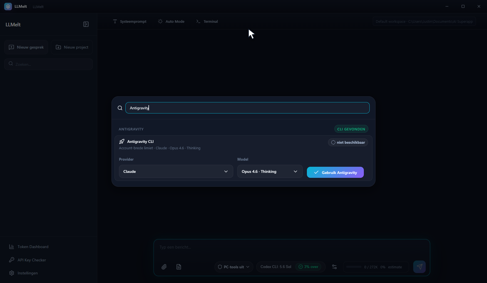
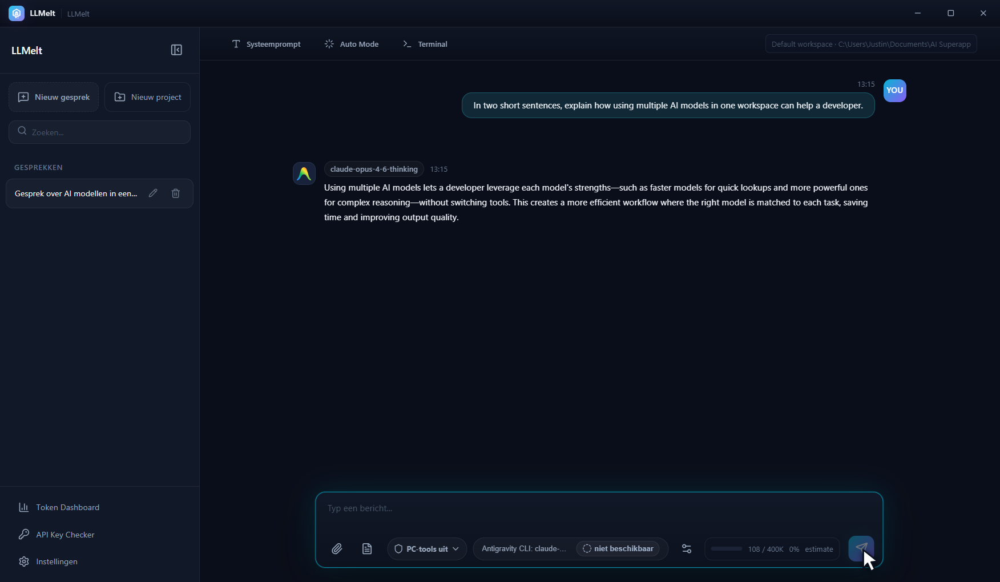
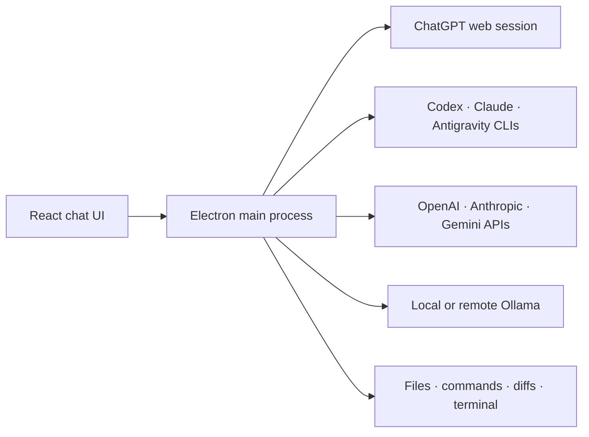

<p align="center">
  
</p>

<h1 align="center">LLMelt</h1>

<p align="center">
  <strong>All your AI models in one Windows app.</strong><br>
  ChatGPT, Claude, Codex, Gemini, Antigravity, Ollama — one chat, one workflow.
</p>

<p align="center">
  <a href="https://github.com/JustMLC4real/LLMelt/releases/latest"></a>
  
  <a href="./LICENSE"></a>
</p>

<p align="center">
  <a href="https://github.com/JustMLC4real/LLMelt/releases/latest"><strong>⬇ Download</strong></a>
  &nbsp;·&nbsp;
  <a href="./docs/README.md">Docs</a>
  &nbsp;·&nbsp;
  <a href="#development">Development</a>
</p>

---

## What is LLMelt?

LLMelt is an Electron desktop app that brings multiple AI providers into one consistent chat and agent interface. Pick a model, talk to it, and let it work with real files and commands on your PC — with your approval.

<p align="center">
  
</p>

---

## Features

🔀 **One model picker** — Live provider catalogs, not a hardcoded list. Search across all your providers and switch models mid-workflow.

🛠️ **Real agent tools** — Read, create and edit project files, run commands, inspect diffs. Tool activity stays right beside the answer.

🔒 **You stay in control** — Three approval modes: ask for every action, auto-allow safe file ops, or explicitly grant full access per chat.

🔄 **Automatic fallback** — When a provider is exhausted or down, continue with the next configured model. Paid API fallback is opt-in.

📊 **Usage dashboard** — Track tokens, context usage and provider quota windows where exposed.

📁 **Projects & terminals** — Group chats by project. Built-in resizable PowerShell terminals.

🏠 **Local-first option** — Ollama runs entirely on your machine, no external quota needed.

---

## Getting started

<p align="center">
  
  
</p>

1. Download [`LLMelt-Setup-*.exe`](https://github.com/JustMLC4real/LLMelt/releases/latest) from GitHub Releases.
2. Run the installer and start LLMelt.
3. The onboarding guide detects what's already on your PC and lets you pick which providers to connect.

> [!NOTE]
> Current builds are not code-signed. Windows SmartScreen may show an "Unknown publisher" warning. Verify the installer comes from this repository before running it.

---

## Supported providers

| Provider | Connection | Agent tools |
|---|---|---|
| **ChatGPT** | Signed-in web session (no API key) | LLMelt tool loop |
| **OpenAI API** | API key | LLMelt tool loop |
| **Codex** | Native CLI login | Native Codex tools + app approvals |
| **Claude** | Claude Code CLI or Anthropic API | Native Claude tools + app approvals |
| **Gemini** | Developer API key + Cloud project | Native function calling + app approvals |
| **Antigravity** | Antigravity CLI | Native CLI hooks + app approvals |
| **Ollama** | Local server | Native function calling |
| **Remote** | SSH to your own Ollama host | Remote model execution |

Provider accounts, subscriptions and API charges are not included with LLMelt.

---

## The interface

<p align="center">
  
  
</p>

---

## Architecture



| Layer | Tech |
|---|---|
| Desktop | Electron 43 |
| UI | React 19, TypeScript, Vite, Zustand |
| Data | Node built-in SQLite (WAL) |
| Build | electron-builder, GitHub Releases |

---

## Development

Requirements: Windows, Node.js 24, npm.

```powershell
git clone https://github.com/JustMLC4real/LLMelt.git
cd LLMelt
npm ci
npm run dev
```

```powershell
npm run lint             # ESLint
npm test                 # logic, fresh-start and security tests
npm run build            # TypeScript + Vite
npm run package          # Windows NSIS installer
```

Full build and release docs: [docs/08-build-release.md](./docs/08-build-release.md)

---

## License

[MIT](./LICENSE) © Justin Laponder
